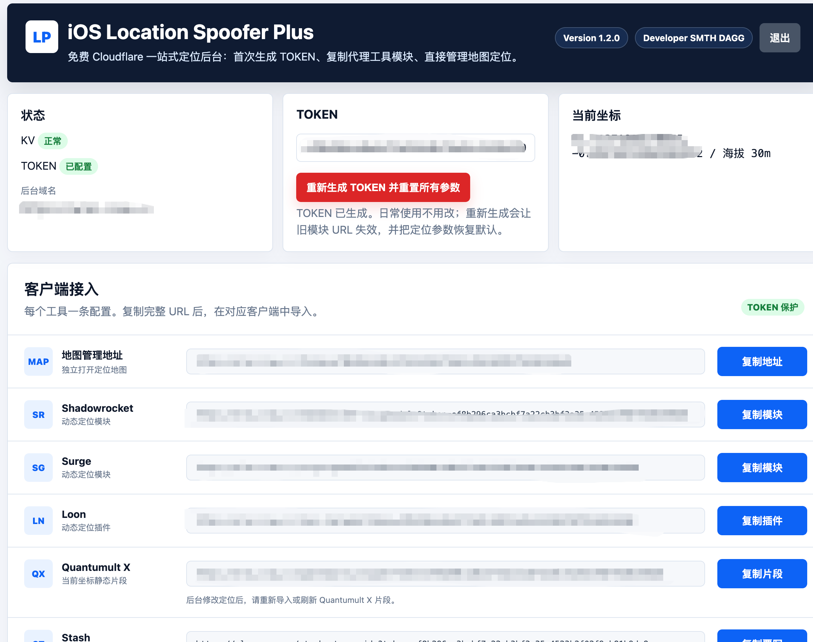
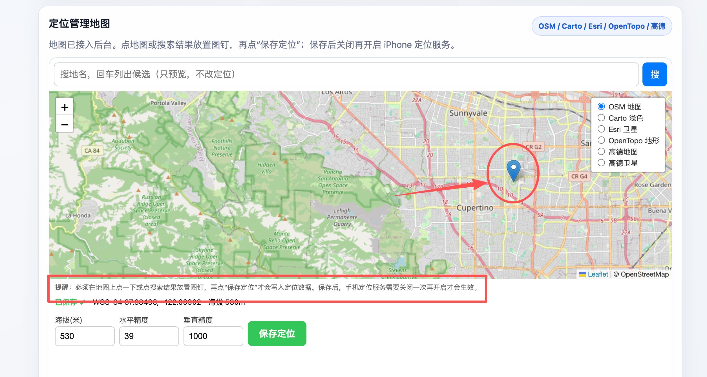

# iOS Location Spoofer Plus 项目说明书

[English](#ios-location-spoofer-plus-project-manual)

版本：`0.2.2-plus`
开发者：SMTH DAGG  
项目地址：[smthdagg/ios-location-spoofer-plus](https://github.com/smthdagg/ios-location-spoofer-plus)  
上游参考：[mekos2772/ios-location-spoofer](https://github.com/mekos2772/ios-location-spoofer)

## 1. 项目简介

`iOS Location Spoofer Plus` 是一个免费的 iPhone 定位管理方案。它把原本需要手动改经纬度参数的定位模块，改造成一个 Cloudflare 免费后台。

手机端负责 HTTPS 解密，Cloudflare 后台负责：

- 生成 TOKEN
- 生成 Shadowrocket / Surge / Loon / Quantumult X / Stash 模块 URL
- 保存定位坐标到 KV
- 提供地图选点
- 提供调试与健康检查



## 2. 项目流程

完整流程如下：

```text
iPhone 代理工具
  → 开启 HTTPS 解密
  → 安装并信任 CA 证书
  → 导入 Plus 后台生成的对应模块
  → 拦截 Apple 定位响应

Cloudflare Plus 后台
  → /admin 登录
  → 生成 TOKEN
  → 生成多客户端模块 URL
  → 地图选点并保存到 KV

iPhone
  → 关闭再开启定位服务
  → Apple 地图 / 天气 / 系统定位读取新坐标
```

## 3. 手机端准备

### 3.1 安装代理工具

你需要一台 iPhone 和一个支持 HTTPS 解密、脚本重写的代理工具。Plus 后台目前生成 Shadowrocket、Surge、Loon、Quantumult X、Stash 的配置 URL。下面以 Shadowrocket 为最详细示例。

### 3.2 导入 Plus 后台生成的模块

Plus 版不推荐直接导入上游静态模块。正确流程是先完成 Cloudflare 部署，在 `/admin` 生成 TOKEN，然后复制后台给出的对应模块 URL。Shadowrocket 示例：

```text
https://你的域名/shadowrocket-v2.sgmodule?token=自动生成的TOKEN
```

Shadowrocket 操作：

1. 配置 → 模块。
2. 删除旧测试模块、旧 Plus 模块或上游基础模块。
3. 右上角 `+`。
4. 来自 URL。
5. 粘贴 Plus 后台生成的模块 URL。
6. 保存并启用。

后续修改定位时，不需要重新导入模块，只需要在 Plus 后台地图保存新坐标。

其他客户端：

- Surge：复制 `surge.sgmodule`。
- Loon：复制 `loon.lnplugin`；`loc.json` 可作为 configUrl 排错。
- Stash：复制 `stash.stoverride`。
- Quantumult X：复制 `quantumultx.snippet`。QX 片段按当前坐标静态生成，后台改定位后需要重新导入或刷新片段。

### 3.3 开启 HTTPS 解密

进入 Shadowrocket 的 HTTPS 解密页面，确认以下域名在 MITM 列表中：

```text
gs-loc.apple.com
gs-loc-cn.apple.com
bluedot.is.autonavi.com
bluedot.is.autonavi.com.gds.alibabadns.com
```

### 3.4 安装并信任 CA 证书

必须完成两步：

1. Shadowrocket 中生成并安装 CA 证书。
2. iPhone 设置 → 通用 → 关于本机 → 证书信任设置 → 完全信任该证书。

证书未完全信任时，模块可能导入成功，但定位不会变化。

## 4. Cloudflare 安装教程

### 4.1 推荐方式：Pages zip 上传

项目维护者生成 zip：

```bash
location-picker/cloudflare-webui/build-pages-zip.sh
```

生成文件：

```text
location-picker/cloudflare-webui/dist/ios-location-spoofer-plus-cloudflare.zip
```

Cloudflare 操作：

1. 打开 Cloudflare Dashboard。
2. 进入 `Workers & Pages`。
3. 点击 `Create application`。
4. 选择 `Pages`。
5. 选择 `Upload assets` / `Direct Upload`。
6. 上传 `ios-location-spoofer-plus-cloudflare.zip`。
7. 等待部署完成。

### 4.2 备选方式：Worker 单文件复制

1. Cloudflare → `Workers & Pages` → `Create application`。
2. 选择 `Worker`。
3. 打开 `Edit code`。
4. 删除默认 Hello World。
5. 粘贴：

```text
location-picker/cloudflare-webui/worker.js
```

6. 点击 `Deploy`。

### 4.3 绑定 KV

创建并绑定 KV namespace。变量名必须是：

```text
LOC_KV
```

KV 用于保存：

- 当前定位
- TOKEN
- 管理后台会话

### 4.4 设置 ADMIN

添加 Secret：

```text
ADMIN
```

`ADMIN` 是 `/admin` 管理后台登录密码。保存后重新部署一次。

## 5. 后台使用

打开：

```text
https://你的域名/admin
```

输入 `ADMIN` 登录。

第一次使用时，点击“生成 TOKEN”。TOKEN 生成后，后台会显示：

- 地图地址
- Shadowrocket 模块 URL
- Surge 模块 URL
- Loon 插件 URL / configUrl
- Quantumult X 片段 URL
- Stash 覆写 URL
- 当前坐标
- KV / TOKEN 状态

TOKEN 生成后日常不需要再操作。如需废弃旧模块 URL，可以点击“重新生成 TOKEN 并重置所有参数”。

## 6. 导入代理工具模块

在后台复制你使用的代理工具模块。Shadowrocket 示例：

```text
https://你的域名/shadowrocket-v2.sgmodule?token=自动生成的TOKEN
```

Shadowrocket 操作：

1. 配置 → 模块。
2. 删除旧测试模块、旧 Plus 模块或上游基础模块。
3. 右上角 `+`。
4. 来自 URL。
5. 粘贴后台生成的模块 URL。
6. 保存并启用。

导入后日常无需反复更新模块。Plus 后台保存定位后，Shadowrocket、Surge、Loon、Stash 会通过 `configHost` / `configToken` 读取 `/loc.json` 中的最新坐标。Quantumult X 目前使用静态片段，后台改坐标后需要重新导入或刷新片段。

如果开代理更新模块时 TLS 报错，给配置服务器域名加直连规则：

```text
DOMAIN,你的域名,DIRECT
DOMAIN-SUFFIX,workers.dev,DIRECT
```

不要把 Cloudflare 后台域名加入 HTTPS 解密列表。

## 7. 地图定位管理



后台地图支持：

- OSM 地图
- Carto 浅色
- Esri 卫星
- OpenTopo 地形
- 高德地图
- 高德卫星

使用步骤：

1. 搜索地点并点击候选，或直接点地图。
2. 地图上出现图钉。
3. 调整海拔、水平精度、垂直精度。
4. 点击“保存定位”。
5. iPhone 定位服务关闭一次再开启。

注意：

- 必须点地图或点搜索结果放置图钉后，再点“保存定位”。
- 保存后 iPhone 定位服务需要关闭一次再开启。
- 高德底图主要适合中国大陆、香港、澳门、台湾；海外建议使用 OSM / Carto / Esri / OpenTopo。

## 8. 调试步骤

### 8.1 检查 Cloudflare

打开：

```text
https://你的域名/health
```

正常结果：

```json
{"ok":true,"kv":true,"tokenConfigured":true,"adminConfigured":true}
```

字段说明：

| 字段 | 含义 |
|------|------|
| `kv` | KV 是否绑定成功 |
| `tokenConfigured` | TOKEN 是否已生成 |
| `adminConfigured` | ADMIN 是否已配置 |

### 8.2 检查 loc.json

打开：

```text
https://你的域名/loc.json?token=你的TOKEN
```

如果这里已经是新坐标，说明后台保存成功。

### 8.3 检查小火箭

确认：

1. 模块已启用。
2. HTTPS 解密已开启。
3. CA 证书已完全信任。
4. MITM 域名完整。
5. 导入的是后台生成的 `shadowrocket-v2.sgmodule`。

### 8.4 使用诊断模块

后台 Worker 提供两个诊断模块：

```text
https://你的域名/shadowrocket-apple.sgmodule?token=你的TOKEN
https://你的域名/shadowrocket-static.sgmodule?token=你的TOKEN
```

- `apple`：硬编码苹果总部。
- `static`：硬编码当前 KV 坐标。

两个都无效时，通常是 Shadowrocket 解密、证书或模块启用问题。

## 9. 常见问题

### 地图页 403

TOKEN 不对。回 `/admin` 复制完整链接。

### 高德地图空白

海外坐标切换到 OSM、Carto、Esri 或 OpenTopo。

### Apple 地图没变化

关闭再开启 iPhone 定位服务，必要时杀掉地图 App 后重开。

### 时区没有跟随

iPhone 时区可能受 SIM 卡和运营商影响。关闭 SIM 后更容易跟随定位变化。

## 10. 版权与法律说明

Copyright © 2026 SMTH DAGG.

本项目仅供个人研究、测试和合法教育用途。使用者必须自行遵守所在地法律法规、平台条款、运营商规则与第三方服务规则。禁止用于欺诈、骚扰、规避执法、未授权访问或任何违法用途。项目按现状提供，不提供任何担保。

---

# iOS Location Spoofer Plus Project Manual

Version: `0.2.2-plus`
Developer: SMTH DAGG  
Repository: [smthdagg/ios-location-spoofer-plus](https://github.com/smthdagg/ios-location-spoofer-plus)  
Upstream reference: [mekos2772/ios-location-spoofer](https://github.com/mekos2772/ios-location-spoofer)

## 1. Overview

`iOS Location Spoofer Plus` is a free iPhone location management project. It turns a manually edited location spoofing module into a Cloudflare-hosted admin dashboard.

The iPhone side handles HTTPS decryption. The Cloudflare side handles:

- TOKEN generation
- Shadowrocket / Surge / Loon / Quantumult X / Stash module URL generation
- Location storage in KV
- Map-based location picking
- Diagnostics and health checks


## 2. Project Flow

```text
iPhone proxy tool
  → Enable HTTPS decryption
  → Install and trust the CA certificate
  → Import the Plus-generated module for your client
  → Intercept Apple location responses

Cloudflare Plus Dashboard
  → Log in to /admin
  → Generate TOKEN
  → Generate multi-client module URLs
  → Pick a location and save it to KV

iPhone
  → Toggle Location Services off and on
  → Apple Maps / Weather / system location reads the new coordinates
```

## 3. iPhone Setup

### 3.1 Install A Proxy Tool

You need an iPhone and a proxy tool that supports HTTPS decryption and script rewriting. Plus currently generates URLs for Shadowrocket, Surge, Loon, Quantumult X, and Stash. Shadowrocket is used as the detailed example below.

### 3.2 Import The Plus-Generated Module

Plus does not recommend importing the upstream static module directly. The correct flow is to deploy Cloudflare first, generate TOKEN in `/admin`, and copy the generated module URL for your client. Shadowrocket example:

```text
https://your-domain/shadowrocket-v2.sgmodule?token=GENERATED_TOKEN
```

Shadowrocket steps:

1. Config → Modules.
2. Delete old test modules, old Plus modules, or upstream base modules.
3. Tap `+`.
4. Choose URL import.
5. Paste the Plus-generated module URL.
6. Save and enable it.

After that, you do not need to re-import the module when changing locations. Save the new coordinates in the Plus dashboard instead.

Other clients:

- Surge: copy `surge.sgmodule`.
- Loon: copy `loon.lnplugin`; `loc.json` can be used as configUrl for troubleshooting.
- Stash: copy `stash.stoverride`.
- Quantumult X: copy `quantumultx.snippet`. QX uses a static snippet generated from the current coordinates, so re-import or refresh it after changing locations in the dashboard.

### 3.3 Enable HTTPS Decryption

In Shadowrocket, enable HTTPS decryption and make sure these MITM hostnames are included:

```text
gs-loc.apple.com
gs-loc-cn.apple.com
bluedot.is.autonavi.com
bluedot.is.autonavi.com.gds.alibabadns.com
```

### 3.4 Install And Trust The CA Certificate

You must complete both steps:

1. Generate and install the CA certificate in Shadowrocket.
2. iPhone Settings → General → About → Certificate Trust Settings → fully trust the certificate.

If the certificate is not fully trusted, the module may import correctly but location spoofing will not work.

## 4. Cloudflare Installation

### 4.1 Recommended: Pages Zip Upload

Maintainers can build the zip package:

```bash
location-picker/cloudflare-webui/build-pages-zip.sh
```

Output:

```text
location-picker/cloudflare-webui/dist/ios-location-spoofer-plus-cloudflare.zip
```

Cloudflare steps:

1. Open Cloudflare Dashboard.
2. Go to `Workers & Pages`.
3. Click `Create application`.
4. Choose `Pages`.
5. Choose `Upload assets` / `Direct Upload`.
6. Upload `ios-location-spoofer-plus-cloudflare.zip`.
7. Wait for deployment.

### 4.2 Alternative: Worker Single-File Paste

1. Cloudflare → `Workers & Pages` → `Create application`.
2. Choose `Worker`.
3. Open `Edit code`.
4. Delete the default Hello World code.
5. Paste:

```text
location-picker/cloudflare-webui/worker.js
```

6. Click `Deploy`.

### 4.3 Bind KV

Create and bind a KV namespace. The binding name must be:

```text
LOC_KV
```

KV stores:

- Current location
- TOKEN
- Admin sessions

### 4.4 Set ADMIN

Add a Secret:

```text
ADMIN
```

`ADMIN` is the password for `/admin`. Redeploy after saving it.

## 5. Dashboard Usage

Open:

```text
https://your-domain/admin
```

Log in with `ADMIN`.

On first use, click “Generate TOKEN”. The dashboard will show:

- Map URL
- Shadowrocket module URL
- Surge module URL
- Loon plugin URL / configUrl
- Quantumult X snippet URL
- Stash override URL
- Current coordinates
- KV / TOKEN status

After TOKEN is generated, you normally do not need to touch it again. Use “Regenerate TOKEN and reset all parameters” only when you want to invalidate old module URLs and restore default location settings.

## 6. Import Proxy Tool Module

Copy the module URL for your client from the dashboard. Shadowrocket example:

```text
https://your-domain/shadowrocket-v2.sgmodule?token=GENERATED_TOKEN
```

Shadowrocket steps:

1. Config → Modules.
2. Delete old test modules, old Plus modules, or upstream base modules.
3. Tap `+`.
4. Choose URL import.
5. Paste the generated module URL.
6. Save and enable it.

You do not need to update the module repeatedly for normal location changes. Shadowrocket, Surge, Loon, and Stash read the latest coordinates from `/loc.json` through `configHost` / `configToken`. Quantumult X currently uses a static snippet, so re-import or refresh it after changing locations.

If module updates fail with TLS errors while proxy is enabled, add direct rules:

```text
DOMAIN,your-domain,DIRECT
DOMAIN-SUFFIX,workers.dev,DIRECT
```

Do not add the Cloudflare dashboard domain to the HTTPS decryption list.

## 7. Map Location Manager


Supported layers:

- OSM
- Carto Light
- Esri Satellite
- OpenTopo
- Amap vector
- Amap satellite

Steps:

1. Search a place and click a result, or click directly on the map.
2. A marker appears.
3. Adjust altitude, horizontal accuracy, and vertical accuracy.
4. Click “Save Location”.
5. Toggle iPhone Location Services off and on.

Notes:

- You must place a marker before saving.
- Toggle Location Services after saving.
- Amap is best for mainland China, Hong Kong, Macau, and Taiwan. For overseas locations, use OSM / Carto / Esri / OpenTopo.

## 8. Debugging

### 8.1 Check Cloudflare

Open:

```text
https://your-domain/health
```

Expected:

```json
{"ok":true,"kv":true,"tokenConfigured":true,"adminConfigured":true}
```

### 8.2 Check loc.json

Open:

```text
https://your-domain/loc.json?token=YOUR_TOKEN
```

If it shows the new coordinates, the dashboard saved correctly.

### 8.3 Check Shadowrocket

Verify:

1. Module is enabled.
2. HTTPS decryption is enabled.
3. CA certificate is fully trusted.
4. MITM hostnames are complete.
5. The imported module is the generated `shadowrocket-v2.sgmodule`.

### 8.4 Diagnostic Modules

```text
https://your-domain/shadowrocket-apple.sgmodule?token=YOUR_TOKEN
https://your-domain/shadowrocket-static.sgmodule?token=YOUR_TOKEN
```

- `apple`: hardcoded Apple Park.
- `static`: hardcoded current KV coordinates.

If neither works, the problem is usually Shadowrocket decryption, certificate trust, or module activation.

## 9. FAQ

### Map page returns 403

The TOKEN is wrong. Copy the full URL from `/admin`.

### Amap is blank

For overseas locations, switch to OSM, Carto, Esri, or OpenTopo.

### Apple Maps does not change

Toggle iPhone Location Services off and on. If needed, force close and reopen Maps.

### Time zone does not follow

iPhone time zone may be affected by SIM carrier information. Disabling SIM can make the spoofed location easier to take effect.

## 10. Copyright And Legal Notice

Copyright © 2026 SMTH DAGG.

This project is provided for personal research, testing, and lawful educational use only. You are responsible for complying with local laws, platform terms, carrier policies, and third-party service rules. Do not use it for fraud, harassment, unauthorized access, evasion of enforcement, or any illegal purpose. No warranty is provided.
