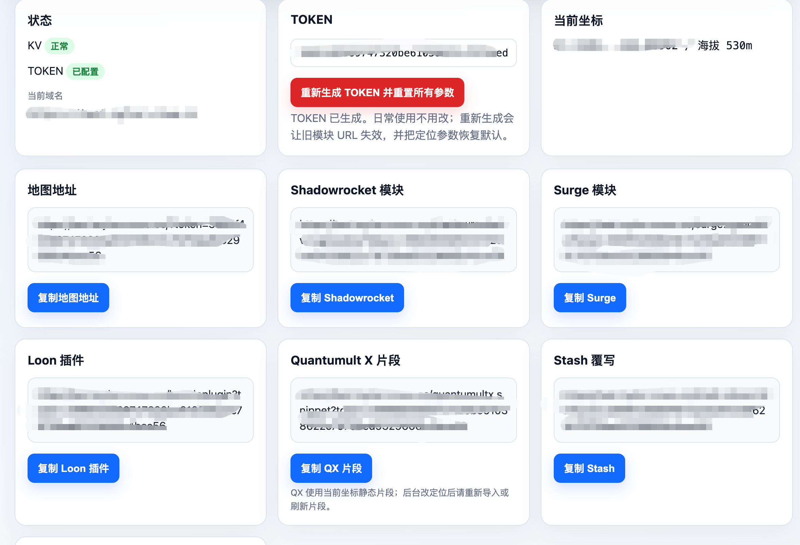

# iOS Location Spoofer Plus

## Language / 语言

- [中文完整教程](#完整中文教程)
- [Full English Guide](#full-english-guide)

免费的一站式 iPhone 定位管理项目。手机端使用支持 HTTPS 解密的代理工具拦截 Apple 定位响应，Cloudflare 端提供 Plus 管理后台：首次生成 TOKEN、生成 Shadowrocket / Surge / Loon / Quantumult X / Stash 模块 URL、直接在地图上保存定位。


## 项目定位

`iOS Location Spoofer Plus` 是一个独立分支项目。它保留上游 JavaScript 定位修改逻辑，同时把部署、TOKEN、模块链接、地图选点和调试流程做成 Cloudflare 免费后台。

上游参考：

- [acheong08/ios-location-spoofer](https://github.com/acheong08/ios-location-spoofer)
- [mekos2772/ios-location-spoofer](https://github.com/mekos2772/ios-location-spoofer)

Plus 版维护：

- Developer: **SMTH DAGG**
- Repo: [smthdagg/ios-location-spoofer-plus](https://github.com/smthdagg/ios-location-spoofer-plus)
- Version: `0.2.2-plus`

## 核心功能

- Shadowrocket 小火箭 HTTPS 解密与 CA 证书流程（保留原项目手机端核心步骤）
- Cloudflare Worker / Pages 免费部署
- `/admin` 管理后台
- 自动生成 TOKEN
- 自动生成 Shadowrocket、Surge、Loon、Quantumult X、Stash 配置 URL
- 后台内嵌地图定位管理
- OSM、Carto、Esri 卫星、OpenTopo、高德地图、高德卫星底图
- `/health` 诊断接口
- 测试模块：苹果总部、当前 KV 坐标

## 完整中文教程

这是一套免费的 iPhone 定位管理方案：手机上用支持 HTTPS 解密的代理工具拦截 Apple 定位接口，Cloudflare 上部署一个 Plus 后台。后台首次生成 TOKEN，随后自动给出各代理工具模块 URL，并直接提供地图定位管理。

教程分四部分：

1. Cloudflare：安装 Plus 后台，生成自己的代理工具模块 URL。
2. 手机端：在 Shadowrocket / Surge / Loon / Quantumult X / Stash 中导入后台生成的对应模块。
3. 手机端：HTTPS 解密、证书安装、开代理、生效。
4. 后台：地图选点、保存定位、调试排查。

## 第一部分：Cloudflare Plus 后台部署

Plus 的方向是类似 edgetunnel：不让用户手动拼 TOKEN，而是部署后进入后台，首次生成 TOKEN 和模块地址。

### 方案 A：zip 上传到 Cloudflare Pages

项目维护者可以先生成 zip：

```bash
location-picker/cloudflare-webui/build-pages-zip.sh
```

生成的文件是：

```text
location-picker/cloudflare-webui/dist/ios-location-spoofer-plus-cloudflare.zip
```

用户在 Cloudflare 里操作：

1. 打开 Cloudflare Dashboard。
2. 进入 Workers & Pages。
3. Create application。
4. 选择 Pages。
5. 选择 Upload assets / Direct Upload。
6. 上传 `ios-location-spoofer-plus-cloudflare.zip`。

### 方案 B：Worker 网页后台复制粘贴

如果不用 zip：

1. Cloudflare → Workers & Pages → Create application。
2. 选择 Worker。
3. 进入 Edit code。
4. 删除默认 Hello World。
5. 粘贴：

```text
location-picker/cloudflare-webui/worker.js
```

6. Deploy。

### 绑定 KV

不管用 Pages 还是 Worker，都要绑定 KV：

1. Cloudflare → Workers & Pages → KV。
2. 创建一个 KV namespace。
3. 回到你的 Pages / Worker 项目。
4. Settings → Bindings。
5. 添加 KV Namespace。
6. 变量名必须填：

```text
LOC_KV
```

### 设置 ADMIN

`ADMIN` 是后台登录密码。

1. 进入项目 Settings。
2. 找到 Variables and Secrets。
3. 添加 Secret。
4. 名字填：

```text
ADMIN
```

5. 值填一个足够长的密码。
6. 保存并重新部署。

新版不需要你手动生成 TOKEN。TOKEN 进入 `/admin` 后首次生成并保存到 KV。

### 进入后台并生成模块 URL

打开：

```text
https://你的域名/admin
```

输入 `ADMIN`，进入 **iOS Location Spoofer Plus** 后台。

第一次进入时点击“生成 TOKEN”，后台会生成 TOKEN，并显示：

- 地图管理地址
- Shadowrocket 模块 URL
- Surge 模块 URL
- Loon 插件 URL / configUrl
- Quantumult X 片段 URL
- Stash 覆写 URL
- 当前坐标
- KV / TOKEN 状态


## 第二部分：导入代理工具模块

后台会把地图地址和各代理工具模块集中展示，复制对应客户端的 URL 即可。



在 `/admin` 后台复制你正在使用的代理工具模块 URL。Shadowrocket 格式类似：

```text
https://你的域名/shadowrocket-v2.sgmodule?token=自动生成的TOKEN
```

然后到 Shadowrocket：

1. 打开 Shadowrocket。
2. 底部点“配置”。
3. 找到“模块”。
4. 删除旧的测试模块、上游基础模块或旧 Plus 模块，避免多个模块互相影响。
5. 点右上角 `+`。
6. 选择“来自 URL”。
7. 粘贴 `/admin` 后台生成的 Shadowrocket 模块 URL。
8. 保存并启用。

其他客户端在后台复制对应 URL 后导入：

- Surge：复制 `surge.sgmodule`，按 Surge 模块方式导入。
- Loon：复制 `loon.lnplugin` 导入插件；也可以复制 `loc.json` 作为 configUrl 排错。
- Stash：复制 `stash.stoverride`，按 Stash Override 导入。
- Quantumult X：复制 `quantumultx.snippet` 导入重写片段。注意 QX 片段使用当前坐标生成，后台修改坐标后需要重新导入或刷新片段。

Shadowrocket、Surge、Loon、Stash 更换定位通常不需要重新导入模块，只需要在 Plus 后台地图保存新位置，再关闭并开启一次 iPhone 定位服务。

如果自定义域名在手机浏览器中无法访问，动态定位也无法读取它。推荐给 Worker 增加 `CLIENT_ORIGIN` 变量，值填写该 Worker 可正常访问的原生 `workers.dev` 地址。后台网页仍使用自定义域名，但生成的模块、脚本和 `/loc.json` 会自动改走原生地址。

只有确认自定义域名在手机上可以访问时，才需要按实际网络策略决定走代理或直连。若“全局代理可访问、配置模式不可访问”，应让该域名走代理，不能写成 `DIRECT`：

```text
DOMAIN,你的域名,PROXY
```

不要把你的 Cloudflare 配置服务器域名加入 HTTPS 解密列表。

## 第三部分：手机端 HTTPS 解密与证书

这部分保留原项目的使用流程，目的是让 Shadowrocket 真正拦截 Apple 定位接口。

### 1. 打开 HTTPS 解密

不同 Shadowrocket 版本入口不完全一样：

- 常见路径：配置 → 当前配置文件右侧 `i` → HTTPS 解密
- 部分版本：设置 → HTTPS 解密

打开 HTTPS 解密后，确认域名列表里有：

```text
gs-loc.apple.com
gs-loc-cn.apple.com
```

只解密以上两个 Apple WLOC 域名。高德域名仅用于网页底图，不属于 Apple 定位响应，不要加入 HTTPS 解密列表。Plus 模块使用完整二进制响应、`max-size=0` 和 30 秒脚本超时，以兼容较大的 WLOC 响应。

如果没有，就手动添加。

### 2. 安装并完全信任 CA 证书

这一步最容易漏。

1. 在 Shadowrocket 的 HTTPS 解密页面点“证书”。
2. 生成新的 CA 证书。
3. 点安装证书。
4. 打开 iPhone 设置 → 通用 → VPN 与设备管理。
5. 安装 Shadowrocket 描述文件。
6. 再进入 设置 → 通用 → 关于本机 → 证书信任设置。
7. 打开 Shadowrocket CA 证书的完全信任开关。

证书没有完全信任时，模块看起来启用了，但定位不会变。

### 3. 开启代理

回到 Shadowrocket 首页，打开总开关，确认 VPN 图标出现。

## 第四部分：后台地图定位管理

Plus 后台把地图也作为管理后台的一部分，不需要再单独打开另一个页面。


### 1. 在后台地图选点

回到 `/admin`，页面下方会出现定位管理地图。

使用方式：

1. 搜索地点，点候选结果；或直接在地图上点一下。
2. 地图出现图钉。
3. 调整海拔、水平精度、垂直精度。
4. 点“保存定位”。

注意两句话：

- 必须在地图上点一下或点搜索结果放置图钉，再点“保存定位”，数据才会写入。
- 保存后，iPhone 定位服务需要关闭一次再开启，系统才会重新请求定位。

### 2. 地图底图怎么选

| 场景 | 推荐底图 |
|------|----------|
| 中国大陆 / 港澳台 | 高德地图、高德卫星 |
| 海外普通选点 | OSM 地图、Carto 浅色 |
| 海外卫星图 | Esri 卫星 |
| 看地形 / 海拔 | OpenTopo 地形 |

高德地图和高德卫星在海外经常空白，这是覆盖范围问题，不代表定位失败。

### 3. 让手机生效

保存后台定位后：

1. iPhone 设置 → 隐私与安全性 → 定位服务。
2. 关闭定位服务。
3. 等 10 秒。
4. 重新开启定位服务。
5. 杀掉地图 / 天气 App 后重开。

如果没变，重复关开定位几次。Apple 定位有缓存，多试几次才会重新请求。

### 4. 手动坐标说明

Plus 后台已经不推荐手动改模块参数。旧模块里的 `latitude`、`longitude`、`altitude` 等参数，现在都由后台 `/loc.json` 动态提供。

需要确认坐标时，打开：

```text
https://你的域名/loc.json?token=你的TOKEN
```

这里显示新经纬度，就说明后台保存成功。

## 调试步骤

### 1. 检查 Cloudflare

打开：

```text
https://你的域名/health
```

正常应返回：

```json
{"ok":true,"kv":true,"tokenConfigured":true,"adminConfigured":true}
```

字段说明：

| 字段 | 含义 |
|------|------|
| `kv` | KV 是否绑定成功 |
| `tokenConfigured` | TOKEN 是否已生成 |
| `adminConfigured` | ADMIN 是否已配置 |

### 2. 检查 loc.json

打开：

```text
https://你的域名/loc.json?token=你的TOKEN
```

如果这里已经是新坐标，说明后台保存成功。

### 3. 检查代理工具

确认：

1. 模块已启用。
2. HTTPS 解密已开启。
3. CA 证书已完全信任。
4. MITM 域名完整。
5. 导入的是后台生成的对应 Plus 模块，且旧模块已经删除或停用。

### 4. 使用诊断模块

后台 Worker 提供两个诊断模块：

```text
https://你的域名/shadowrocket-apple.sgmodule?token=你的TOKEN
https://你的域名/shadowrocket-static.sgmodule?token=你的TOKEN
```

- `apple`：硬编码苹果总部。
- `static`：硬编码当前 KV 坐标。

两个都无效时，通常是 Shadowrocket 解密、证书或模块启用问题。

## 常见问题

### `/admin` 打不开或提示配置缺失

检查 Cloudflare 是否已经：

- 绑定 `LOC_KV`
- 设置 Secret `ADMIN`
- 保存后重新部署

### 地图页 403

TOKEN 不对。回到 `/admin` 复制后台生成的完整地址。

### 模块导入了但定位没变化

按顺序检查：

1. 代理工具模块是否启用。
2. HTTPS 解密是否开启。
3. CA 证书是否完全信任。
4. 四个 Apple / 高德定位域名是否在 MITM 列表。
5. 是否删除了旧模块并导入后台生成的 Plus 模块。
6. 保存后台坐标后是否关闭再开启 iPhone 定位服务。

### 当前坐标对了，但时区不变

iPhone 时区可能受 SIM 卡运营商影响。之前实测关闭 SIM 后，系统时间会更容易跟随新定位。能否手动关闭自动时区取决于系统设置和运营商策略。

## 最短流程

```text
Cloudflare 上传 Plus zip / Worker
→ 绑定 LOC_KV，设置 ADMIN
→ 打开 /admin，生成 TOKEN
→ 复制对应代理工具模块 URL 并导入
→ 代理工具开启 HTTPS 解密 → 安装并信任 CA 证书
→ 后台地图点位置并保存
→ iPhone 定位关一次再开
```

## 版权与法律说明

Copyright © 2026 SMTH DAGG.

本项目仅供个人研究、测试和合法教育用途。使用者必须自行遵守所在地法律法规、平台条款、运营商规则与第三方服务规则。禁止用于欺诈、骚扰、规避执法、未授权访问或任何违法用途。项目按现状提供，不提供任何担保。

---

## Full English Guide

`iOS Location Spoofer Plus` is a free iPhone location management project. It turns a manually edited location spoofing module into a Cloudflare-hosted admin dashboard.

The iPhone side handles HTTPS decryption. The Cloudflare side handles:

- TOKEN generation
- Shadowrocket / Surge / Loon / Quantumult X / Stash module URL generation
- Location storage in KV
- Map-based location picking
- Diagnostics and health checks


### 1. Project Flow

```text
iPhone proxy tool
  -> Enable HTTPS decryption
  -> Install and trust the CA certificate
  -> Import the Plus-generated module for your client
  -> Intercept Apple location responses

Cloudflare Plus Dashboard
  -> Log in to /admin
  -> Generate TOKEN
  -> Generate multi-client module URLs
  -> Pick a location and save it to KV

iPhone
  -> Toggle Location Services off and on
  -> Apple Maps / Weather / system location reads the new coordinates
```

### 2. iPhone Setup

#### 2.1 Install A Proxy Tool

You need an iPhone and a proxy tool that supports HTTPS decryption and script rewriting. Plus currently generates URLs for Shadowrocket, Surge, Loon, Quantumult X, and Stash. Shadowrocket is used as the detailed example below.

#### 2.2 Import The Plus-Generated Module

Plus does not recommend importing the upstream static module directly. The correct flow is to deploy Cloudflare first, generate TOKEN in `/admin`, and copy the generated module URL for your client. Shadowrocket example:

```text
https://your-domain/shadowrocket-v2.sgmodule?token=GENERATED_TOKEN
```

Shadowrocket steps:

1. Config -> Modules.
2. Delete old test modules, old Plus modules, or upstream base modules.
3. Tap `+`.
4. Choose URL import.
5. Paste the Plus-generated module URL.
6. Save and enable it.

After that, you do not need to re-import the module when changing locations. Save the new coordinates in the Plus dashboard instead.

Other clients:

- Surge: copy `surge.sgmodule`.
- Loon: copy `loon.lnplugin`; `loc.json` can be used as configUrl for troubleshooting.
- Stash: copy `stash.stoverride`.
- Quantumult X: copy `quantumultx.snippet`. QX uses a static snippet generated from the current coordinates, so re-import or refresh it after changing locations in the dashboard.

#### 2.3 Enable HTTPS Decryption

In Shadowrocket, enable HTTPS decryption and make sure these MITM hostnames are included:

```text
gs-loc.apple.com
gs-loc-cn.apple.com
```

Decrypt only these two Apple WLOC hosts. Amap hostnames are map-tile sources, not Apple location-response endpoints, and must not be added to MITM. Plus uses the complete binary response with `max-size=0` and a 30-second script timeout.

#### 2.4 Install And Trust The CA Certificate

You must complete both steps:

1. Generate and install the CA certificate in Shadowrocket.
2. iPhone Settings -> General -> About -> Certificate Trust Settings -> fully trust the certificate.

If the certificate is not fully trusted, the module may import correctly but location spoofing will not work.

### 3. Cloudflare Installation

#### 3.1 Recommended: Pages Zip Upload

Maintainers can build the zip package:

```bash
location-picker/cloudflare-webui/build-pages-zip.sh
```

Output:

```text
location-picker/cloudflare-webui/dist/ios-location-spoofer-plus-cloudflare.zip
```

Cloudflare steps:

1. Open Cloudflare Dashboard.
2. Go to `Workers & Pages`.
3. Click `Create application`.
4. Choose `Pages`.
5. Choose `Upload assets` / `Direct Upload`.
6. Upload `ios-location-spoofer-plus-cloudflare.zip`.
7. Wait for deployment.

#### 3.2 Alternative: Worker Single-File Paste

1. Cloudflare -> `Workers & Pages` -> `Create application`.
2. Choose `Worker`.
3. Open `Edit code`.
4. Delete the default Hello World code.
5. Paste:

```text
location-picker/cloudflare-webui/worker.js
```

6. Click `Deploy`.

#### 3.3 Bind KV

Create and bind a KV namespace. The binding name must be:

```text
LOC_KV
```

KV stores:

- Current location
- TOKEN
- Admin sessions

#### 3.4 Set ADMIN

Add a Secret:

```text
ADMIN
```

`ADMIN` is the password for `/admin`. Redeploy after saving it.

### 4. Dashboard Usage

Open:

```text
https://your-domain/admin
```

Log in with `ADMIN`.

On first use, click “Generate TOKEN”. The dashboard will show:

- Map URL
- Shadowrocket module URL
- Surge module URL
- Loon plugin URL / configUrl
- Quantumult X snippet URL
- Stash override URL
- Current coordinates
- KV / TOKEN status

After TOKEN is generated, you normally do not need to touch it again. Use “Regenerate TOKEN and reset all parameters” only when you want to invalidate old module URLs and restore default location settings.


### 5. Import Proxy Tool Module

Copy the module URL for your client from the dashboard. Shadowrocket example:

```text
https://your-domain/shadowrocket-v2.sgmodule?token=GENERATED_TOKEN
```

Shadowrocket steps:

1. Config -> Modules.
2. Delete old test modules, old Plus modules, or upstream base modules.
3. Tap `+`.
4. Choose URL import.
5. Paste the generated module URL.
6. Save and enable it.

You do not need to update the module repeatedly for normal location changes. Shadowrocket, Surge, Loon, and Stash read the latest coordinates from `/loc.json` through `configHost` / `configToken`. Quantumult X currently uses a static snippet, so re-import or refresh it after changing locations.

If the custom domain cannot be opened on the phone, set `CLIENT_ORIGIN` to the Worker's reachable native `workers.dev` URL. The dashboard stays on the custom domain while client modules, scripts, and `/loc.json` use the native endpoint.

If the domain works only in global proxy mode, route it through the proxy in configuration mode:

```text
DOMAIN,your-domain,PROXY
```

Do not add the Cloudflare dashboard domain to the HTTPS decryption list.

### 6. Map Location Manager


Supported layers:

- OSM
- Carto Light
- Esri Satellite
- OpenTopo
- Amap vector
- Amap satellite

Steps:

1. Search a place and click a result, or click directly on the map.
2. A marker appears.
3. Adjust altitude, horizontal accuracy, and vertical accuracy.
4. Click “Save Location”.
5. Toggle iPhone Location Services off and on.

Notes:

- You must place a marker before saving.
- Toggle Location Services after saving.
- Amap is best for mainland China, Hong Kong, Macau, and Taiwan. For overseas locations, use OSM / Carto / Esri / OpenTopo.

### 7. Debugging

#### 7.1 Check Cloudflare

Open:

```text
https://your-domain/health
```

Expected:

```json
{"ok":true,"kv":true,"tokenConfigured":true,"adminConfigured":true}
```

#### 7.2 Check loc.json

Open:

```text
https://your-domain/loc.json?token=YOUR_TOKEN
```

If it shows the new coordinates, the dashboard saved correctly.

#### 7.3 Check The Proxy Tool

Verify:

1. The module is enabled.
2. HTTPS decryption is enabled.
3. The CA certificate is fully trusted.
4. MITM hostnames are complete.
5. The imported module is the Plus-generated module for your client.

#### 7.4 Diagnostic Modules

```text
https://your-domain/shadowrocket-apple.sgmodule?token=YOUR_TOKEN
https://your-domain/shadowrocket-static.sgmodule?token=YOUR_TOKEN
```

- `apple`: hardcoded Apple Park.
- `static`: hardcoded current KV coordinates.

If neither works, the problem is usually HTTPS decryption, certificate trust, or module activation.

### 8. FAQ

#### Map page returns 403

The TOKEN is wrong. Copy the full URL from `/admin`.

#### Amap is blank

For overseas locations, switch to OSM, Carto, Esri, or OpenTopo.

#### Apple Maps does not change

Toggle iPhone Location Services off and on. If needed, force close and reopen Maps.

#### Time zone does not follow

iPhone time zone may be affected by SIM carrier information. Disabling SIM can make the spoofed location easier to take effect.

### 9. Copyright And Legal Notice

Copyright © 2026 SMTH DAGG.

This project is provided for personal research, testing, and lawful educational use only. You are responsible for complying with local laws, platform terms, carrier policies, and third-party service rules. Do not use it for fraud, harassment, unauthorized access, evasion of enforcement, or any illegal purpose. No warranty is provided.
