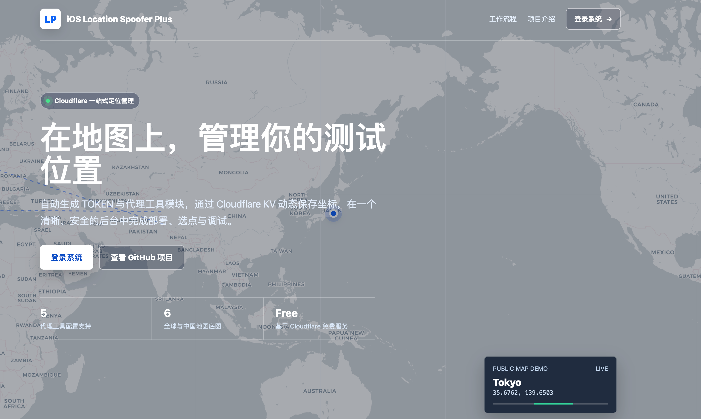
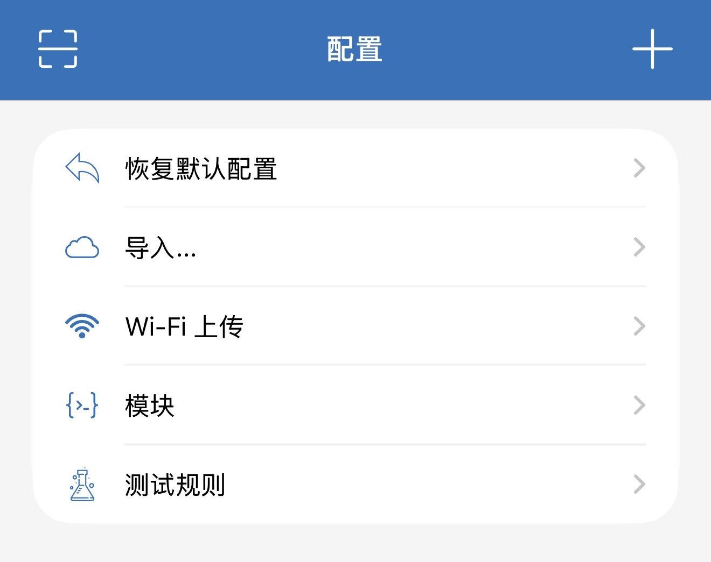
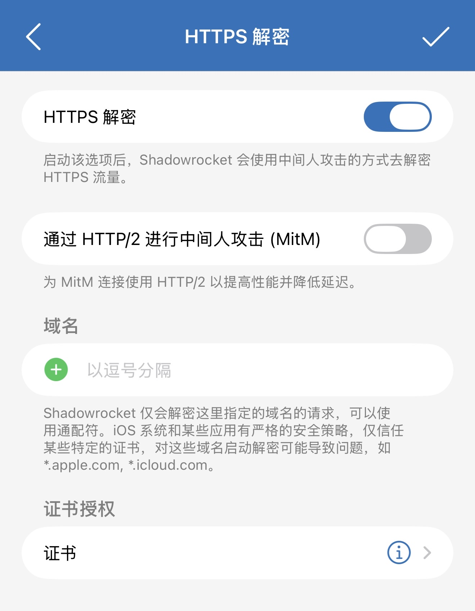
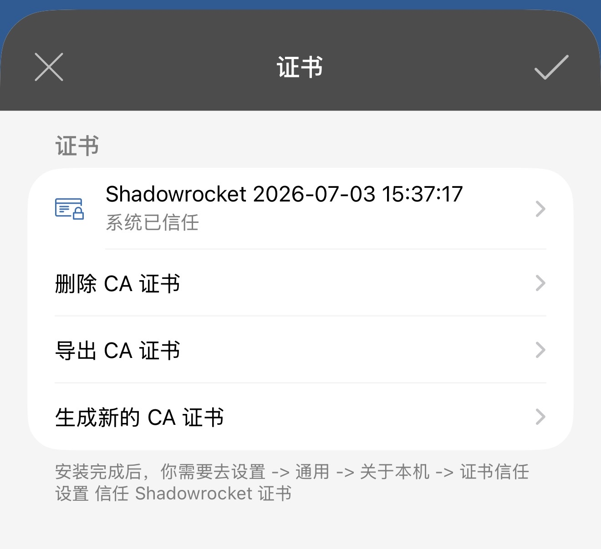
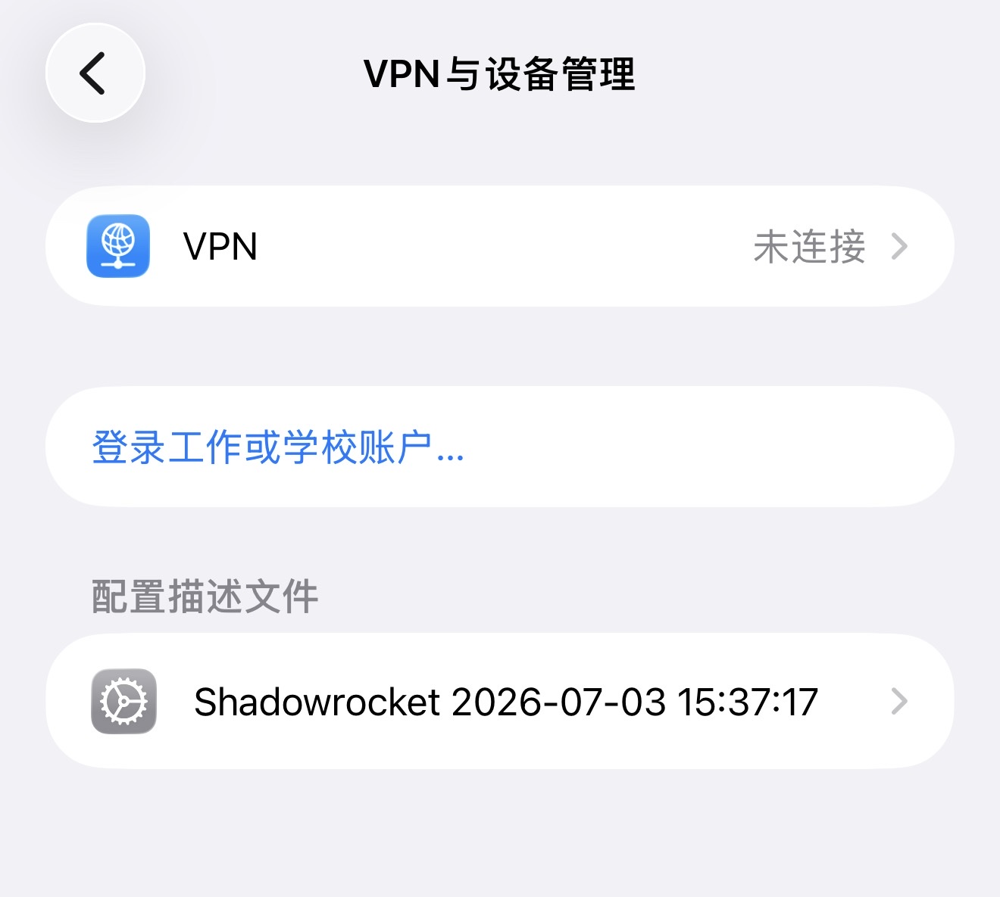
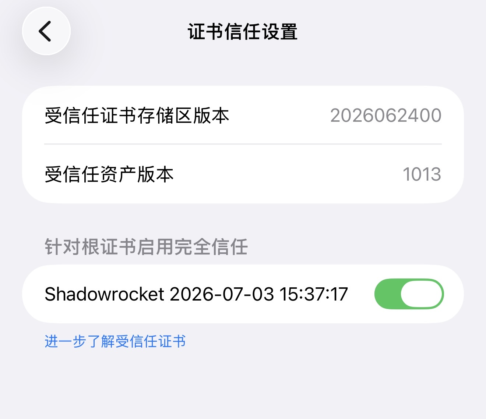

# iOS Location Spoofer Plus 完整的安装使用教程

> 适用版本：`v1.2.0` 及以上<br>
> 配置工具：Shadowrocket（小火箭）<br>
> 部署平台：Cloudflare Workers / Pages + KV<br>
> 项目地址：[smthdagg/ios-location-spoofer-plus](https://github.com/smthdagg/ios-location-spoofer-plus)

本教程面向第一次接触 Cloudflare 和 Shadowrocket 的用户，从 Cloudflare 部署、后台初始化、模块导入、HTTPS 解密和证书安装，一直讲到地图选点、生效检查与排错。

## 目录

1. [开始前准备](#一开始前准备)
2. [下载 Cloudflare 部署包](#二下载-cloudflare-部署包)
3. [在 Cloudflare 上传项目](#三在-cloudflare-上传项目)
4. [创建并绑定 KV](#四创建并绑定-kv)
5. [设置后台管理密码 ADMIN](#五设置后台管理密码-admin)
6. [登录后台并生成 TOKEN](#六登录后台并生成-token)
7. [在 Shadowrocket 导入模块](#七在-shadowrocket-导入模块)
8. [开启 HTTPS 解密和 HTTP/2 MitM](#八开启-https-解密和-http2-mitm)
9. [生成、安装并完全信任 CA 证书](#九生成安装并完全信任-ca-证书)
10. [在后台地图选择位置](#十在后台地图选择位置)
11. [让新定位在 iPhone 生效](#十一让新定位在-iphone-生效)
12. [检查与排错](#十二检查与排错)
13. [安全与隐私](#十三安全与隐私)

## 一、开始前准备

你需要：

- 一个 Cloudflare 账号。
- 一台 iPhone。
- 已安装 Shadowrocket。
- 一个可在 iPhone 上正常访问的 Cloudflare 分配域名或自定义域名。
- 能正常联网的 Shadowrocket 配置。

项目运行流程：

```text
Cloudflare Worker / Pages
  → KV 保存 TOKEN 和坐标
  → /admin 提供管理后台
  → 后台生成 Shadowrocket 模块 URL

Shadowrocket
  → 导入后台生成的唯一正式模块
  → HTTPS 解密 Apple WLOC 响应
  → 动态读取 /loc.json 中的坐标

iPhone
  → 关闭再开启一次定位服务
  → 地图、天气和系统服务重新请求定位
```

项目公开首页如下。公开地图只播放演示城市，不会读取你的 TOKEN 或 KV 私有坐标。



## 二、下载 Cloudflare 部署包

1. 打开项目的 [GitHub Releases](https://github.com/smthdagg/ios-location-spoofer-plus/releases/latest)。
2. 在最新版本的 `Assets` 中下载：

```text
ios-location-spoofer-plus-cloudflare.zip
```

3. 不要解压后重新压缩。直接保留下载的 zip 文件。

如果 Cloudflare 网页后台不接受 zip，也可以打开项目文件：

```text
location-picker/cloudflare-webui/worker.js
```

在 Worker 网页编辑器中删除默认的 Hello World，再粘贴整个 `worker.js`。

## 三、在 Cloudflare 上传项目

Cloudflare 控制台的名称可能随版本调整，但操作原则相同。

1. 登录 [Cloudflare Dashboard](https://dash.cloudflare.com/)。
2. 进入 `Workers & Pages`。
3. 点击 `Create application` 或“创建应用程序”。
4. 选择 `Pages`。
5. 选择 `Upload assets` / `Direct Upload`。
6. 输入项目名称，例如：

```text
ios-location-spoofer-plus
```

7. 上传 `ios-location-spoofer-plus-cloudflare.zip`。
8. 点击部署，等待 Cloudflare 给出 `pages.dev` 地址。

部署后先不要急着使用。此时还必须配置 `LOC_KV` 和 `ADMIN`。

### Worker 单文件方式

如果你选择 Worker：

1. `Workers & Pages` → `Create application` → `Worker`。
2. 点击 `Edit code`。
3. 删除默认代码。
4. 粘贴 `location-picker/cloudflare-webui/worker.js` 的全部内容。
5. 点击 `Deploy`。

## 四、创建并绑定 KV

KV 用来保存：

- 自动生成的 TOKEN。
- 当前经纬度、海拔和精度。
- 后台登录会话。

### 4.1 创建 KV Namespace

1. 在 Cloudflare 控制台进入 `Storage & Databases` → `KV`。
2. 点击创建 Namespace。
3. 名称可以填写：

```text
ios-location-spoofer-plus
```

### 4.2 绑定到项目

1. 回到刚刚部署的 Worker 或 Pages 项目。
2. 进入 `Settings` → `Bindings`。
3. 添加 `KV Namespace` 绑定。
4. 变量名必须准确填写：

```text
LOC_KV
```

5. Namespace 选择刚创建的 KV。
6. 保存设置。

变量名写错时，后台无法保存 TOKEN 和定位数据。

## 五、设置后台管理密码 ADMIN

1. 进入项目 `Settings` → `Variables and Secrets`。
2. 添加一个 Secret。
3. 名称必须填写：

```text
ADMIN
```

4. 值填写你自己的强密码。
5. 保存后重新部署一次项目。

建议密码：

- 至少 12 位。
- 同时包含大小写字母、数字和符号。
- 不要使用教程示例密码。
- 不要把 ADMIN 写进 GitHub、截图或公开聊天。

## 六、登录后台并生成 TOKEN

直接打开你的域名：

```text
https://你的域名/
```

会进入公开项目首页。点击“登录系统”，或直接打开：

```text
https://你的域名/admin
```

输入刚才设置的 `ADMIN` 密码。

第一次进入后台：

1. 确认 KV 显示“正常”。
2. 点击“生成 TOKEN”。
3. TOKEN 会自动保存到 KV。
4. 后台会生成地图地址和 Shadowrocket 模块地址。

新版后台把每种工具排列为独立的一行。截图中的域名、TOKEN 和坐标已经模糊处理；公开教程中不要展示自己的完整信息。


### TOKEN 注意事项

- TOKEN 生成一次后，日常不需要修改。
- 不要点击“重新生成 TOKEN 并重置所有参数”，除非你确定要让旧模块 URL 全部失效。
- TOKEN 不是后台登录密码，但拿到 TOKEN 的人可以读取和修改该部署的定位数据，因此同样不能公开。

## 七、在 Shadowrocket 导入模块

### 7.1 复制模块 URL

在 Plus 后台找到 `Shadowrocket` 一行，点击“复制模块”。地址形式类似：

```text
https://你的域名/shadowrocket-v2.sgmodule?token=你的TOKEN
```

必须复制后台生成的完整 URL，不能只复制域名。

### 7.2 删除旧定位模块

在导入前，删除或停用以下旧模块：

- Apple Test。
- Static Test。
- 上游基础定位模块。
- 旧 Plus 模块。
- 其他会拦截 Apple WLOC 的定位模块。

只保留一个由当前 Plus 后台生成的正式模块。多个模块同时拦截时，常见表现是后台保存伦敦或香港，手机却一直停在苹果总部。

### 7.3 从 URL 导入

1. 打开 Shadowrocket。
2. 底部进入“配置”。
3. 点击右上角 `+` 或进入“模块”。



4. 选择“从 URL 添加”或“下载模块”。
5. 粘贴 Plus 后台复制的完整模块 URL。
6. 保存并启用模块。

模块更新时不需要重新生成 TOKEN。日常更换定位只需在后台地图保存新坐标。

## 八、开启 HTTPS 解密和 HTTP/2 MitM

进入 Shadowrocket 当前配置的 HTTPS 解密页面。不同版本入口可能是：

```text
配置 → 当前配置右侧信息按钮 → HTTPS 解密
```

或者：

```text
设置 → HTTPS 解密
```

必须打开两个开关：

1. `HTTPS 解密`
2. `通过 HTTP/2 进行中间人攻击 (MitM)`



> 重要：截图中 HTTP/2 MitM 开关尚未开启。实际使用时必须把它打开。

### 域名输入框要不要填写？

不需要手动填写。正式 Plus 模块会自动注入：

```text
gs-loc.apple.com
gs-loc-cn.apple.com
```

不要手动加入：

- Plus 后台域名。
- `workers.dev` 或 `pages.dev` 域名。
- 高德地图瓦片域名。
- 阿里 DNS 域名。
- `*.apple.com` 或 `*.icloud.com` 这类过大的通配范围。

模块只需要解密两个 Apple WLOC 域名。

## 九、生成、安装并完全信任 CA 证书

只有打开 HTTPS 解密还不够，CA 证书必须同时完成“安装”和“完全信任”。

### 9.1 在 Shadowrocket 生成证书

1. 在 HTTPS 解密页面点击“证书”。
2. 如果没有证书，点击“生成新的 CA 证书”。
3. 点击证书并选择安装。

安装完成后，Shadowrocket 会显示证书状态。不同版本文字可能略有区别。



### 9.2 在 iOS 安装描述文件

1. 打开 iPhone“设置”。
2. 如果顶部出现“已下载描述文件”，先进入并安装。
3. 或进入：

```text
设置 → 通用 → VPN 与设备管理
```

4. 找到 Shadowrocket 描述文件并完成安装。



### 9.3 完全信任根证书

描述文件安装完成后，还必须执行：

```text
设置 → 通用 → 关于本机 → 证书信任设置
```

打开 Shadowrocket 根证书右侧的完全信任开关。



如果没有完成完全信任，模块可以正常导入，后台坐标也能保存，但 Apple 定位响应不会被成功修改。

## 十、在后台地图选择位置

回到：

```text
https://你的域名/admin
```

后台下方会加载定位管理地图。

操作步骤：

1. 搜索地点，然后点击搜索候选；或直接在地图上点一下。
2. 确认地图出现图钉。
3. 根据需要调整海拔、水平精度和垂直精度。
4. 点击绿色的“保存定位”。
5. 看到“已保存”状态后再操作手机。


必须记住两句话：

- 必须在地图上点击一次或点击搜索结果放置图钉，再点击“保存定位”。
- 只移动或缩放地图不会修改定位。

### 地图底图建议

| 使用地区 | 建议底图 |
|---|---|
| 中国大陆、香港、澳门、台湾 | 高德地图、高德卫星 |
| 海外普通地图 | OSM、Carto |
| 海外卫星图 | Esri 卫星 |
| 地形和海拔参考 | OpenTopo |

高德底图在海外出现空白属于地图覆盖范围问题，不代表定位保存失败。

## 十一、让新定位在 iPhone 生效

后台保存后：

1. 确认 Shadowrocket 模块已经启用。
2. 确认 Shadowrocket 总开关已经打开。
3. 打开 iPhone：

```text
设置 → 隐私与安全性 → 定位服务
```

4. 关闭定位服务。
5. 等待约 5 至 10 秒。
6. 重新开启定位服务。
7. 强制退出地图、天气等需要测试的 App，再重新打开。

Apple 定位服务可能有缓存。如果第一次没有变化，再关闭并开启一次定位服务。

## 十二、检查与排错

### 12.1 检查 Cloudflare

打开：

```text
https://你的域名/health
```

正常应返回：

```json
{"ok":true,"kv":true,"tokenConfigured":true,"adminConfigured":true}
```

如果某个字段为 `false`：

- `kv=false`：检查 KV 是否绑定为 `LOC_KV`。
- `tokenConfigured=false`：登录后台生成 TOKEN。
- `adminConfigured=false`：添加 `ADMIN` Secret 并重新部署。

### 12.2 检查后台是否保存坐标

在后台复制地图地址，或者打开：

```text
https://你的域名/loc.json?token=你的TOKEN
```

如果 JSON 已显示新经纬度，说明 Cloudflare 与 KV 工作正常。

### 12.3 模块导入后仍是苹果总部

这通常不是后台问题，而是旧模块冲突：

1. 删除 Apple Test 和 Static Test。
2. 删除上游旧模块和重复 Plus 模块。
3. 只重新导入后台生成的一个正式 Shadowrocket 模块。
4. 确认模块处于启用状态。

### 12.4 定位完全没有变化

按顺序检查：

1. Shadowrocket 总开关是否打开。
2. Plus 正式模块是否启用。
3. HTTPS 解密是否打开。
4. HTTP/2 MitM 是否打开。
5. CA 描述文件是否安装。
6. CA 根证书是否完全信任。
7. 保存定位后是否关闭再开启定位服务。

### 12.5 模块 URL 无法更新或 TLS 报错

- 先确认手机浏览器能直接打开 Plus 项目域名。
- 不要把 Plus 后台域名加入 HTTPS 解密域名列表。
- 标准安装不需要额外添加 `DIRECT`、`PROXY`、Fake-IP、DNS 或 CNAME 规则。
- 删除旧模块后，再从后台复制完整模块 URL 导入。

### 12.6 定位变化但时区没变

时区还可能受到 SIM 卡、运营商信息和“自动设置”影响。定位修改成功不保证系统时区一定同步变化，这不代表定位模块失效。

## 十三、安全与隐私

- 不公开 `ADMIN` 密码。
- 不公开完整 TOKEN 或带 TOKEN 的模块 URL。
- 不公开后台保存的精确坐标，除非你确认可以披露。
- 发布 Cloudflare 后台截图前，必须模糊域名、TOKEN、模块 URL 和坐标。
- 不要多人共用同一个 TOKEN；建议每位使用者独立部署自己的 Cloudflare 项目。
- 重新生成 TOKEN 会让全部旧模块 URL 失效，并可能重置定位参数。
- 本项目仅供个人研究、开发测试和合法教育用途。

## 最短操作清单

```text
下载最新 Cloudflare zip
→ Cloudflare Pages / Worker 部署
→ 创建 KV 并绑定为 LOC_KV
→ 设置 ADMIN Secret 并重新部署
→ 登录 /admin 生成 TOKEN
→ 复制 Shadowrocket 模块 URL
→ 删除旧定位模块，只导入一个正式模块
→ 开启 HTTPS 解密和 HTTP/2 MitM
→ 生成、安装并完全信任 CA 证书
→ 后台地图放置图钉并保存
→ iPhone 定位服务关闭后重新开启
```

---

Copyright © 2026 SMTH DAGG. 本教程与项目仅供个人研究、测试和合法教育用途。
